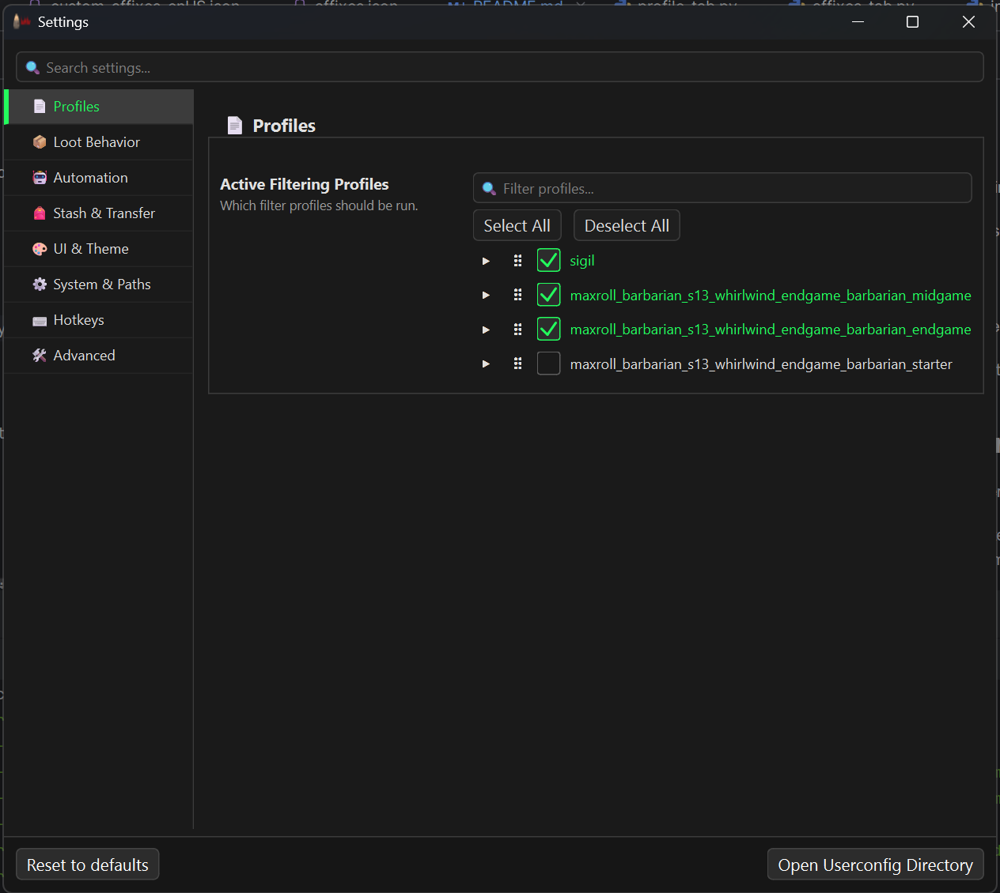
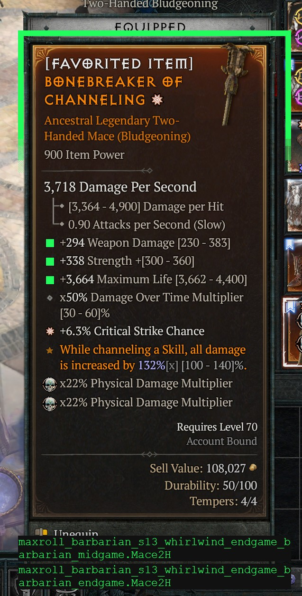
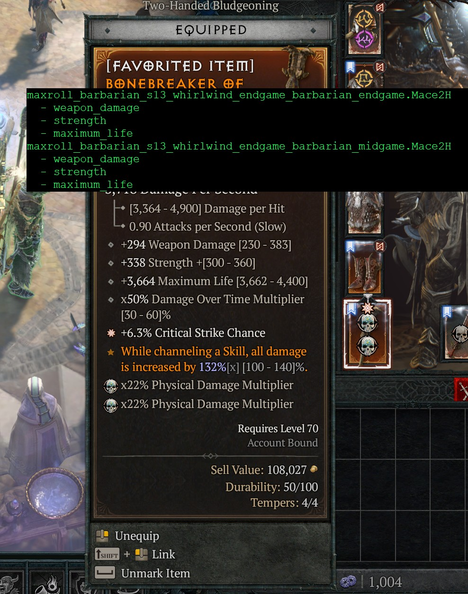
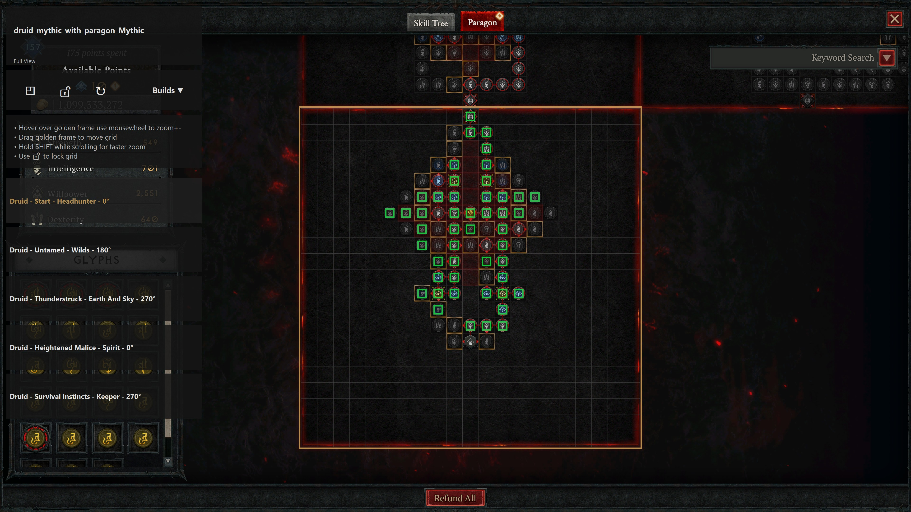
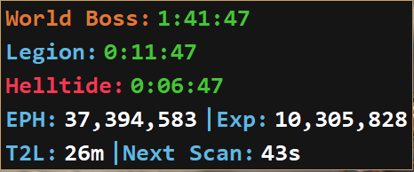
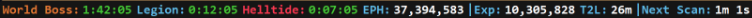
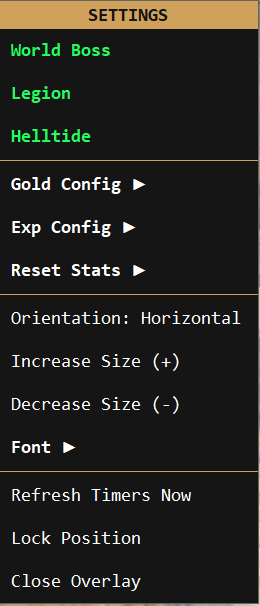
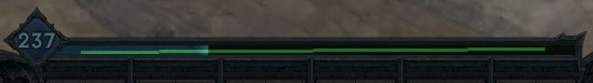

# 

Filter items and sigils in your inventory based on affixes, aspects and thresholds of their values. For questions,
feature request or issue reports join the [discord](https://discord.gg/YyzaPhAN6T) or use github issues.


## Features

- Filter items in inventory and stash
- Filter by item type, item power and greater affix count
- Filter by affix and their values, with per-affix greater affix requirements
- Filter uniques by their affix and aspect values
- Filter sigils by blacklisting and whitelisting locations and affixes
- Filter tributes by name or rarity
- Quickly move items from your stash or inventory
- Supported resolutions are all aspect ratios between 16:10 and 21:9
- Info Panel Overlay for tracking world events and session statistics
- Paragon Overlay with import from supported build planners (Mobalytics, Maxroll, D4Builds)

## How to Setup

### Installation and quick start guide (New instructions for season 12 that must be followed!)

- Download and extract the latest version (.zip) from the releases: https://github.com/d4lfteam/d4lf/releases
- Find your "Diablo IV" directory. Copy the path and have it in your clipboard:
  - In Battle.net, click the gear icon next to the Play button and select "Open in Explorer"
  - In Steam, right click the game, select Manage > Browse local files
- D4LF gets item information by reading the screen and using TTS information sent for accessibility. TTS setup takes additional steps, detailed below. For more information on the install_dll.cmd script, see [the TTS section](https://github.com/d4lfteam/d4lf/blob/main/README.md#tts)
  - Navigate to your downloaded d4lf directory
  - Double-click `install_dll.cmd`
    - If asked for administrator permissions, provide them.
    - When asked for your Diablo 4 path, provide it
    - When asked to install a certificate, allow it.
    - If everything is successful, proceed with the guide. Otherwise join the [discord](https://discord.gg/YyzaPhAN6T) or post an issue in github.
- Generate a profile of what Diablo 4 items you want to filter for. To do so you have a few options:
  - Run d4lf.exe and import a profile using the import window by pasting a build page from popular planner websites
  - Create one yourself by looking at the [examples](#how-to-filter--profiles) below and using the profile editor to recreate
- If created manually (not recommended), place the profile in the `C:/Users/<WINDOWS_USER>/.d4lf/profiles` folder. The D4LF
  Settings window has a button to open this folder directly. If imported they are placed there automatically.
- Run d4lf.exe and use the Settings button to configure the profiles in the Profile section. Check the box next to the profiles you would like to use.
- Ensure all [game settings](#game-settings) are configured properly.
- If you made changes, restart d4lf.exe and launch Diablo 4.
- Use the hotkeys listed in d4lf.exe to run filtering. By default, F11 will run the loot filter and filter your items.
- For most common issues, if something is wrong, you will see an error or warning when you start d4lf.exe. Join our [discord](https://discord.gg/YyzaPhAN6T) for more help.

### Game Settings

- Game Language must be English
- IMPORTANT: Advanced Tooltip Information must be enabled in Options > Gameplay > Gameplay. If you don't do this then item parsing will be very inconsistent and you will receive no warning something is wrong.
- Font scale in Graphics settings must be small or medium
- HDR makes the screen too bright and D4LF is unable to read the state of some items on screen. It must be disabled.
- Use Screen Reader must be enabled in Options > Accessibility
- 3rd Party Screen Reader must be enabled in Options > Accessibility (The voice will go away when DLL is installed, see quick start guide above)

### Common problems

- The tool shows a warning saying "TTS connection has not been made yet." but I've set everything up correctly.
  - If you're seeing this error, it means D4LF has found the DLL is in the correct location but the TTS connection is
    still not being made. This is most likely due to an issue with your windows user not allowing Diablo to connect to
    the third party screen reader. The following steps should resolve it:
    - Set Diablo 4 to run as administrator. First, navigate to your Diablo 4 directory.
      - Steam User: Right click on the game and choose Properties. In that menu, go to Installed Files and hit Browse.
      - Battle.net User: On the game page, click the gear icon and choose Show in Explorer
    - Right-click on Diablo IV.exe and go to Properties. In the Compatibility tab, check the box that says "Run this program as an administrator"
    - Run Diablo 4 again through Steam/Battle.net and see if that resolved the issue.
    - If it did not, set Steam/Battle.net to run as administrator as well and make sure you are running Diablo through Steam. This should resolve the issue.
- The GUI crashes immediately upon opening, with no error message given
  - This almost always means there is an issue in your params.ini, the backing file for our Settings. Delete the file in `C:/Users/<WINDOWS_USER>/.d4lf/` and then open the GUI and configure
    your params.ini through the Settings window in D4LF. Using the GUI for configuration will ensure the file is always accurate.
- Mouse control isn't possible
  - Due to your local windows settings, the tool might not be able to control the mouse. Just run the tool as admin
    and it should work. If you don't want to run it as admin, you can disable the mouse control entirely by enabling Settings > Automation > Vision Mode Only

### TTS

D4 uses a third-party TTS engine called Tolk. Tolk has a feature that allows custom third-party TTS DLLs to be loaded.
D4 automatically loads the DLL, which actually just sends the text to another application rather than reading it aloud.
This is similar to having a Braille TTS application for D4.

The TTS dll (`saapi64.dll`) must be signed for Diablo 4 to pick it up. The `install_dll.cmd` script handles all of this for you. It will:

- Copy the dll file to the Diablo 4 directory
- Download the signtool needed to add a local signature to the dll
- Runs the signtool and signs the dll

If you prefer running it from a terminal, you can run `.\install_dll.cmd`.

For very advanced users that don't want to automatically download signtool.exe, you can run `.\install_dll.cmd -signtool_path "<full path to signtool.exe>"`

## GUI Overview

d4lf.exe is the one-stop shop for all operations, including running the D4LF process and any configuration changes.

If you prefer a standalone console-only experience, you can run d4lf-consoleonly.bat instead which will not open a GUI
as well. It is still recommended you open the GUI for any configurations management.

Current functionality:

- Import builds from maxroll/d4builds/mobalytics
- Complete management of your settings through the Settings window
- A beta version of a manual profile editor/creator

### Main Screen

(Documentation in progress)

The main screen contains the log of what D4LF is doing when it is filtering items. Any errors are posted here.

It contains navigation buttons to get to the Profile Importer, Settings, and Profile Editor.

### Profile Importer

(Documentation in progress)

Import profiles from the following popular build sites: Maxroll, Mobalytics, D4Builds.

The importer should be fairly self-documented. Hover over any option for more information on that option.

### Settings Window

The Settings Window is where you configure anything and everything for D4LF.



Each setting is documented within the window so click through to see what you might be interested in changing.

Some commonly modified setting sections:

#### Profiles

This is where you activate/deactivate your profiles. You can change the order of the profiles as well by dragging on the
6 dot icon. The top listed profile is what Vision Mode With Highlighting will show squares for when hovering over an
item so the order can matter. However, if an item matches any profile at all it will be kept.

#### Loot Behavior

Here you can change how we handle items that don't match a filter at all, for example uniques or codex upgrades.

#### Stash & Transfer

It's important to set how many stash tabs you have access to. If you do not own any of the expansions, change the Max Stash Tabs value to 6.

Note that D4LF will not work with stash tabs until you've unlocked all of them.

#### UI & Theme

You can enable dark/light mode here if interested.

This section also contains the two vision modes, which you can swap between.

If you enable "highlight_matches" then matched affixes will have a green box drawn over the affix bullets on the screen. This is the classic vision mode, but is a little slower and mildly error prone as we are relying on reading the screen to determine affix locations.



If you instead enable "fast" vision mode, we do not read the screen at all but instead place relevant information on the screen immediately. Fast vision mode works with controllers. Both vision modes show the same information, just in different ways.



If you would like for the fast vision mode box to appear somewhere else, you can modify its location in Settings > Advanced > Fast Vision Mode Coordinates.

### Profile Editor

(Documentation still in progress)

The Profile Editor allows you to edit your profiles. It is still in beta, but all functionality except Sigils should work at this time.

## How to filter / Profiles

All profiles define whitelist filters. If no filter included in your profiles matches the item, it will be discarded.

Your config files will be validated on startup and will prevent the program from starting if the structure or syntax is
incorrect. The error message will provide hints about the specific problem.

The following sections will explain each type of filter that you can specify in your profiles. How you define them in
your YAML files is up to you; you can put all of these into just one file or have a dedicated file for each type of
filter, or even split the same type of filter over multiple files. Ultimately, all profiles specified in
the Profiles section of Settings will be used to determine if an item should be kept. If one of the profiles wants to keep the item, it
will be kept regardless of the other profiles. Similarly, if a filter is missing in all profiles (e.g., there is
no `Sigils` section in any profile), all corresponding items (in this case, sigils) will be kept.

### Affix / Unique Aspect Filter Syntax

You have two choices on how to specify aspects or affixes of an item. For both options we recommend importing a profile first and then working from there.

- You can use the Edit Profile window in the GUI, which is the recommended approach
- You can also manually edit your profile.

The instructions below are all about editing the file manually, but the explanations apply to the GUI as well.

<details><summary>Examples</summary>

```yaml

# Filter for attack speed
- { name: attack_speed }
# Filter for attack speed with a threshold value.
# The filter keeps larger rolls when the tooltip range increases and smaller rolls when the range decreases.
- { name: attack_speed, value: 4 }
# Filter for attack speed where the affix is greater than 50% of the potential maximum
- { name: attack_speed, minPercentOfAffix: 50 }
```

</details>

### Affixes

Affixes are defined by the top-level key `Affixes`. It contains a list of filters that you want to apply. Each filter
has a name and can filter for any combination of the following:

- `itemType`: The name of the type or a list of multiple types.
  See [assets/lang/enUS/item_types.json](assets/lang/enUS/item_types.json)
- `minPower`: Minimum item power
- `minGreaterAffixCount`: Minimum number of greater affixes expected on the overall item. See [Greater Affix Filtering](#greater-affix-filtering) for more information on filtering GAs.
- `affixPool`: A list of multiple different rulesets to filter for. Each ruleset must be fulfilled or the item is
  discarded
  - `count`: Define a list of affixes (see [syntax](#affix--unique-aspect-filter-syntax)) and
    optionally `minCount`, `maxCount` and `minGreaterAffixCount`
    - `minCount`: specifies the minimum number of affixes that must match the item. defaults to amount of specified
      affixes
    - `maxCount` specifies the maximum number of affixes that must match the item. defaults to amount of specified
      affixes
- `inherentPool`: The same rules as for `affixPool` apply, but this is evaluated against the inherent affixes of the
  item
- `uniqueAspect`: If you're looking for a specific unique, this is how you define it. It has the following properties:
  - `name`: (Required) The name of the unique you are looking for. You can find a list in [uniques.json](assets/lang/enUS/uniques.json)
  - `value`: What is the minimum value the aspect must have. You can not have both this and minPercentOfAspect
  - `minPercentOfAspect`: Instead of defining a specific value, what percent of the potential maximum value of the aspect should we keep. See [this section](#filtering-on-percent-of-affix-instead-of-value) for more information.

<details><summary>Config Examples</summary>

```yaml
Affixes:
  # Search for chest armor and pants that are at least item level 725 and have at least 3 affixes of the affixPool
  - NiceArmor:
      itemType: [ chest armor, pants ]
      minPower: 725
      affixPool:
        - count:
            - { name: dexterity, value: 33 }
            - { name: damage_reduction, value: 5 }
            - { name: lucky_hit_chance, value: 3 }
            - { name: total_armor, value: 9 }
            - { name: maximum_life, value: 700 }
          minCount: 3

  # Search for chest armor that is at least item level 925 and have at least 3 affixes of the affixPool. At least 2 of the matched affixes must be greater affixes
  - NiceArmor:
      itemType: chest armor
      minPower: 925
      affixPool:
        - count:
            - { name: dexterity }
            - { name: damage_reduction }
            - { name: lucky_hit_chance }
            - { name: total_armor }
            - { name: maximum_life }
          minCount: 3
          minGreaterAffixCount: 2

  # Search for boots that have at least 2 of the specified affixes and either max evade charges or reduced evade cooldown as inherent affix
  - GreatBoots:
      itemType: boots
      minPower: 800
      inherentPool:
        - count:
            - { name: maximum_evade_charges }
            - { name: attacks_reduce_evades_cooldown_by_seconds }
          minCount: 1
      affixPool:
        - count:
            - { name: movement_speed, value: 16 }
            - { name: cold_resistance }
            - { name: lightning_resistance }
          minCount: 2

  # Search for boots that have at least 2 of the specified affixes AND are a Penitent Greaves
  # The Greaves must have at least 19% damage multiplier to chilled enemies (Greaves's range is 15-25)
  # Note this would not match non-unique boots that have movement speed and cold resistance, it will only match a Penitent Greaves
  - GreatUniqueBoots:
      itemType: boots
      minPower: 800
      affixPool:
        - count:
            - { name: movement_speed, value: 16 }
            - { name: cold_resistance }
            - { name: lightning_resistance }
          minCount: 2
      uniqueAspect:
        - name: penitent_greaves
          minPercentOfAspect: 50

  # You can also search for multiple unique aspects at once. This is mostly used by the importers for mythics
  # Keep all penitent greaves or gohrs_devastating_grips with 900 power
  - HighPowerUniques:
      minPower: 900
      uniqueAspect:
        - name: penitent_greaves
        - name: gohrs_devastating_grips

  # Search for boots with movement speed and 1 resistances from a pool of all resistances.
  # No need to add maxCount to the resistance group since it isn't possible for an item to have more than one resistance affix
  - ResBoots:
      itemType: boots
      minPower: 800
      affixPool:
        - count:
            - { name: movement_speed, value: 16 }
        - count:
            - { name: shadow_resistance }
            - { name: cold_resistance }
            - { name: lightning_resistance }
            - { name: fire_resistance }
            - { name: poison_resistance }
          minCount: 1

  # Search for boots with movement speed. At least two of all item affixes must be a greater affix, but we don't care which
  - GreaterAffixBoots:
      itemType: boots
      minPower: 800
      minGreaterAffixCount: 2
      affixPool:
        - count:
            - { name: movement_speed, value: 16 }

  # Keep all ancestral items, even if they don't match a different filter
  - AncestralMatch:
      minPower: 900
```

</details>

Affix names are lower case and spaces are replaced by underscore. You can find the full list of names
in [assets/lang/enUS/affixes.json](assets/lang/enUS/affixes.json).

### Filtering on percent of affix instead of value

You also have the option to filter on the minimum percent of the affix you want instead of a specific value. For example, say you want strength on an item. The potential values for strength are 100-150. If you say the `minPercentOfAffix` for strength is 50 (which means 50%), then strength rolls of 125 and up are kept and rolls below 125 would be discarded.

A greater affix is considered to always match a `minPercentOfAffix`. You do not need to designate larger/smaller for `value` or `minPercentOfAffix`; that is automatically determined from the roll range.

If you put in `minPercentOfAffix` you can not also put `value` for that affix. It must be one or the other.

These rules also apply for `minPercentOfAspect` on the `uniqueAspect` and in `GlobalUniques`.

<details><summary>Config Examples</summary>

```yaml
Affixes:
  # Search for chest armor that is at least item level 925 and have at least 3 affixes of the affixPool.
  # It must have more than 40 damage_reduction, and armor must be at least 70% of its potential maximum affix value
  - NiceArmor:
      itemType: chest armor
      minPower: 925
      affixPool:
        - count:
            - { name: dexterity }
            - { name: damage_reduction, value: 40 }
            - { name: lucky_hit_chance }
            - { name: armor, minPercentOfAffix: 70 }
            - { name: maximum_life }
          minCount: 3

```

</details>

### Greater Affix Filtering

D4LF provides two complementary ways to filter items based on Greater Affixes:

#### 1. Item-Level Greater Affix Count (`minGreaterAffixCount`)

This filter requires a minimum total number of Greater Affixes on the entire item, regardless of which affixes they are.

<details><summary>Example</summary>

```yaml
Affixes:
  - GreaterAffixBoots:
      itemType: boots
      minGreaterAffixCount: 2  # Item must have at least 2 Greater Affixes total
      affixPool:
        - count:
            - { name: movement_speed }
            - { name: maximum_life }
            - { name: strength }
            - { name: fire_resistance }
          minCount: 3
```

</details>

#### 2. Per-Affix Greater Affix Requirements (`want_greater`)

When using the Profile Editor GUI or when importing affixes using the importer, you can mark/import specific affixes
with a "Greater" checkbox. This is shown as `want_greater` in the profile. This is a list of affixes that you would prefer
to be greater affixes. The `minGreaterAffixCount` value on the item is still respected, so if you have two affixes tagged
as `want_greater` but a `minGreaterAffixCount` of 1, an item with one of those two affixes as GA will be kept. If neither
of those affixes are GA but a different one is, the item will not be kept.

<details><summary>Example</summary>

```yaml
Affixes:
  - PerfectBoots:
      itemType: boots
      affixPool:
        - count:
            - { name: movement_speed, want_greater: true }  # MUST be a Greater Affix
            - { name: maximum_life, want_greater: true }    # MUST be a Greater Affix
            - { name: strength }                            # Can be normal or Greater
            - { name: fire_resistance }                      # Can be normal or Greater
          minCount: 3
      minGreaterAffixCount: 2  # Auto-set by GUI if Auto-Sync is checked, or Require Greater Affixes is checked on the importer
```

**This item would match:** Boots with movement_speed (GA), maximum_life (GA), cold_resistance (normal), fire_resistance (normal)\
**Why:** movement_speed and maximum_life are both Greater Affixes as required, and item has 4 affixes (meets minCount of 3)

**This item would NOT match:** Boots with movement_speed (normal), maximum_life (GA), cold_resistance (normal), fire_resistance (normal)\
**Why:** movement_speed is marked as `want_greater: true` but is not a Greater Affix on the item

</details>

#### Common Use Cases

<details><summary>Examples</summary>

**"I want boots with at least 2 Greater Affixes, don't care which ones"**

```yaml
- itemType: boots
  minGreaterAffixCount: 2
  affixPool:
    - count:
        - { name: movement_speed }
        - { name: maximum_life }
        - { name: strength }
        - { name: fire_resistance }
      minCount: 3
```

**"I want boots where movement_speed MUST be a Greater Affix"**

```yaml
- itemType: boots
  minGreaterAffixCount: 1  # The minGreaterAffixCount is important, if it was 0 then movement_speed would not be required to be GA
  affixPool:
    - count:
        - { name: movement_speed, want_greater: true }
        - { name: maximum_life }
        - { name: strength }
        - { name: fire_resistance }
      minCount: 3
```

**"I want boots where both movement_speed AND maximum_life MUST be Greater Affixes"**

```yaml
- itemType: boots
  minGreaterAffixCount: 2  # minGreaterAffixCount of 2 requires both to be GA
  affixPool:
    - count:
        - { name: movement_speed, want_greater: true }
        - { name: maximum_life, want_greater: true }
        - { name: strength }
        - { name: fire_resistance }
      minCount: 3
```

**"I want boots where either movement_speed OR maximum_life are Greater Affixes"**

```yaml
- itemType: boots
  minGreaterAffixCount: 1  # minGreaterAffixCount of 1 requires either to be GA
  affixPool:
    - count:
        - { name: movement_speed, want_greater: true }
        - { name: maximum_life, want_greater: true }
        - { name: strength } # If strength on the item was greater and the top two were not, this would not be matched
        - { name: fire_resistance }
      minCount: 3
```

</details>

### AspectUpgrades

Legendary Aspects that you want to be notified of receiving upgrades for can be placed in your profile.
They are defined in the top-level key `AspectUpgrades`.

This filter is generally for build-specific aspects that you'd like to be made aware of when you receive an upgrade so you can
upgrade that aspect immediately at the occultist. We notify the user by favoriting the item and showing orange text or
orange highlighting when hovering over the item.

If the item matches any other profile, this filter does nothing. This filter does respect the `mark_as_favorite` config property.
Any aspects that do not match this filter or are not codex upgrades are handled by the `keep_aspects` config property.

<details><summary>Config Examples</summary>

```yaml
AspectUpgrades:
  # This would mark Snowveiled Adventurer's Pants as a favorite if it's a codex upgrade. It would ignore the pants otherwise.
  - of_singed_extremities
  - snowveiled
```

```yaml
# This works exact same as above, it's just a different way to format it
AspectUpgrades: [of_singed_extremities, snowveiled]
```

</details>

Aspect names are lower case and spaces are replaced by underscore. You can find the full list of names
in [assets/lang/enUS/aspects.json](assets/lang/enUS/aspects.json).

### Sigils

Sigils are defined by the top-level key `Sigils`. It contains a list of affix or location names that you want to filter
for. If no Sigil filter is provided, all Sigils will be kept.

<details><summary>Config Examples</summary>

```yaml
Sigils:
  blacklist:
    # locations
    - endless_gates
    - vault_of_the_forsaken

    # affixes
    - armor_breakers
    - resistance_breakers
```

If you want to filter for a specific affix or location, you can also use the `whitelist` key. Even if `whitelist` is
present, `blacklist` will be used to discard sigils that match any of the blacklisted affixes or locations.

```yaml
# Only keep sigils for vault_of_the_forsaken without any of the affixes armor_breakers and resistance_breakers
Sigils:
  blacklist:
    - armor_breakers
    - resistance_breakers
  whitelist:
    - vault_of_the_forsaken
```

To switch that priority, you can add the `priority` key with the value `whitelist`.

```yaml
# This will keep all vault of the forsaken sigils even if they have armor_breakers or resistance_breakers
Sigils:
  blacklist:
    - armor_breakers
    - resistance_breakers
  whitelist:
    - vault_of_the_forsaken
  priority: whitelist
```

You can also create conditional filters based on a single affix or location.

```yaml
# Only keep sigils for iron_hold when it also has shadow_damage
Sigils:
  blacklist:
    - armor_breakers
    - resistance_breakers
  whitelist:
    - [ iron_hold, shadow_damage ]
```

</details>

Sigil affixes and location names are lower case and spaces are replaced by underscore. You can find the full list of
names in [assets/lang/enUS/sigils.json](assets/lang/enUS/sigils.json).

### Tributes

Tributes are defined by the top-level key `Tributes`. It contains a list of either tribute names or rarities you want
to keep. Any not in the list are not kept. If no Tribute filter is provided, all Tributes will be kept.

Mythic tributes are always kept no matter what.

<details><summary>Config Examples</summary>

```yaml
# Keeps tribute_of_mystique and all legendary and unique tributes
Tributes:
  - tribute_of_mystique
  - [legendary, unique]
```

If you're exceptionally pressed for time, you can just put the name of the tribute without "tribute_of\_" at the beginning.

```yaml
# Keeps Tribute of Mystique and Tribute of Ascendance (Resolute) and nothing else
Tributes:
  - mystique
  - ascendance_resolute
```

</details>

Tribute names are lower case and spaces are replaced by underscore. Parentheses are removed. Note that United and
Resolute identifiers are part of the names in [assets/lang/enUS/tributes.json](assets/lang/enUS/tributes.json). You can find the list of item rarities
in [rarity.py](src/item/data/rarity.py)

### GlobalUniques

If you are searching for a specific Unique, use the `uniqueAspect` key in [the Affixes section](#affixes). If you
additionally want to keep other uniques that have particular stats, use the `GlobalUniques` key.

Global unique filters are defined by the top-level key `GlobalUniques`. It contains a list of parameters that you want
to filter for. If no global unique filter is provided or if the item does not match any unique filter (affix or otherwise),
uniques will be handled according to the handle_uniques configuration. All mythics are marked as favorite regardless of
any filter or configuration.

The following global filters are available:

- `minGreaterAffixCount`: Only keep uniques with a specific number of greater affixes
- `minPercentOfAspect`: Only keep uniques whose aspect is above a percentage of the total possible.
  For example, if this is set to 80 and an aspect has a range of 100-200, then a value of 180 would be kept but a value
  of 150 would be marked as junk. Situations where a smaller value is what is wanted are automatically handled as well.
- `minPower`: The minimum item power of uniques to keep
- `profileAlias`: In vision mode, uniques show as <filename>.<aspect>. For example myuniques.yaml with fists_of_fate aspect defined
  would show as myuniques.fists_of_fate. The label for the filename can be configured at the aspect level using the
  profileAlias flag (see examples).

<details><summary>Config Examples</summary>

```yaml
# Take all uniques with item power > 900
GlobalUniques:
  - minPower: 900
```

```yaml
# Take all uniques with at least 1 greater affix. It would show in logs/vision mode as cool_stuff.<name of unique>
GlobalUniques:
  - minGreaterAffixCount: 1
    profileAlias: cool_stuff
```

```yaml
# Note that if a unique matches any filter, it is kept. Each - denotes a new filter.
# For example, the below will keep all uniques that have two greater affixes OR an aspect percentage greater than 80
GlobalUniques:
  - minGreaterAffixCount: 2
  - minPercentOfAspect: 80
```

```yaml
# Conversely, this will match all uniques that have two greater affixes AND an aspect percentage greater than 80
GlobalUniques:
  - minGreaterAffixCount: 2
    minPercentOfAspect: 80
```

</details>

## Paragon overlay



D4LF can import Paragon boards from supported build planners and show them in-game using the Paragon overlay.

**How to use**

1. Import your build from a supported planner (Mobalytics / Maxroll / D4Builds).
1. Enable **Import Paragon** in the importer. Paragon data will be stored in your profile YAMLs in the profiles folder (default: `~/.d4lf/profiles`).
1. Toggle the Paragon overlay using the hotkey (default **F10**, configurable in *Advanced options*).
1. Follow the on-screen instructions to zoom in and out of the overlay until it is the size you want. Ideally, the golden outline will be the same size as the red lines in the paragon board. The location of the overlay is automatically saved.

**Tips**

- Overlays may not work in exclusive fullscreen; use **borderless windowed** if the overlay does not appear.
- Planner websites can change over time. If an import/export stops working, please report a bug.

## Info Panel Overlay




The Info Panel provides real-time tracking for World Events and session-based statistics for Gold and Experience.

**How to use**

1. Toggle the overlay using the hotkey (default **F6**, configurable in *Advanced options*).
1. **Move**: Click and drag the overlay to your preferred location.
1. **Settings**: Right-click anywhere on the overlay to open the context menu.
1. **Lock**: Once positioned, select **Lock Position** from the right-click menu to prevent accidental movement.



**Features and Settings (Right-Click Menu)**

- **Visibility Toggles**: Directly enable/disable the display of **World Boss**, **Legion**, and **Helltide** timers.
- **Timers**:
  - Timers automatically sync with [Helltides.com](https://helltides.com).
  - **World Boss & Legion**: Countdowns are green, flashing orange in the last 5 minutes.
  - **Helltide**:
    - When active, the timer is yellow, flashing orange in the last 5 minutes.
    - The break period before the next Helltide is green, flashing orange in the last 1 minute.
- **Gold Config (Submenu)**:
  - **Track Gold**: Master toggle to enable/disable gold tracking. When disabled, other gold-related options are grayed out.
  - **Show Gold Per Hour**: Displays your calculated Gold Per Hour for the current session.
  - **Show Gold Gained**: Shows total gold accumulated since the last reset.
- **Exp Config (Submenu)**:
  - **Track Exp**: Master toggle to enable/disable experience tracking. When disabled, other exp-related options are grayed out.
  - **Show EXP Per Hour**: Displays your calculated Experience Per Hour.
  - **Show EXP Gained**: Shows total experience accumulated since the last reset.
  - **Show Time to Level**: Estimated time remaining until your next level based on current EPH.
  - **Show Next Scan**: Shows the remaining cooldown until the next automatic experience check.
  - **Auto Capture EXP When Inventory Opened**: If enabled, the tool will automatically hover your experience bar to scan values whenever you open your inventory.
  - **EXP Capture Time (Submenu)**: Set the cooldown interval (e.g., Never, 0m, 3m) for automatic scans.
  - **Configure EXP Bar Position**: Calibrate the tool by dragging a box over your experience bar on screen.
  - **Reset EXP Bar Position**: Resets the custom EXP bar position to default.
- **Reset Stats (Submenu)**:
  - **Reset Gold**: Clears current session gold data and sets a new baseline.
  - **Reset Exp**: Clears current session experience data.
- **UI Adjustments**:
  - **Orientation**: Switch between **Horizontal** and **Vertical** layouts.
  - **Increase/Decrease Size**: Adjust the font size and overall scale of the overlay.
- **Font (Submenu)**:
  - Select your preferred font family for the overlay text.
- **System**:
  - **Refresh Timers Now**: Manually force a refresh of event data from the web.
  - **Lock Position**: Disables dragging to keep the overlay static.
  - **Close Overlay**: Closes the Info Panel Overlay.

**Exp Bar Position Suggestion**
Configure exp bar position as shown here. This position seems to work the best for easy data captures.


**Tracking Logic**

- The overlay captures data via the game's Text-to-Speech (TTS) system.
- **Gold Tracking**:
  - To initialize, turn on track gold and open inventory.
  - Includes verification logic to ignore transient "Sell Value" tooltips from items.
- **Experience Tracking**:
  - To initialize, simply hover over your experience bar in-game.
  - **Automatic Scanning**: If "Inv Open (Capture EXP)" is enabled in settings, the overlay will automatically move your mouse over the experience bar to scan for updates whenever you open your inventory.
  - **Cooldown**: The "EXP Capture Time" setting controls how frequently these automatic scans occur, preventing excessive mouse movements.

## Future Plans

- A video explaining the initial setup
- Finish GUI documentation
- Want something done that's not mentioned here? Leave a suggestion in the [discord](https://discord.gg/YyzaPhAN6T) or use github issues. Or, make the changes yourself and open up a PR!

## Advanced User Information

This information is not really relevant to anyone, but preserved here for people who want to get into the weeds of how D4LF operates.

### Configs

The config folder in `C:/Users/<WINDOWS_USER>/.d4lf` contains:

- **profiles/\*.yaml**: These files determine what should be filtered. Profiles created by the GUI will be placed here
  automatically.
- **params.ini**: Different hotkey settings and number of chest stashes that should be looked at. Management of this
  file should be done through the GUI in the config window.

It is not expected you will modify these files manually, but the location could be useful to know in case of strange errors.

## Develop

### Setup using uv

If you intend to submit PRs, create your own fork of d4lf and clone that in the steps below.

Before beginning, [install uv](https://docs.astral.sh/uv/getting-started/installation/#winget).

```bash
git clone https://github.com/d4lfteam/d4lf
cd d4lf
uv sync
uv run python -m src.main
```

If you receive an error about missing Visual Studio code, follow the link it provides. Install Visual Studio Build Tools 2022 with the defaults selected and also select "MSVC VS 2022 C++ ..." and "Windows 11 SDK ...". Restart your terminal and try again.

This StackOverflow provides a good outline on the proper process for keeping your main branch up to date and submitting PRs: https://stackoverflow.com/questions/20956154/whats-the-workflow-to-contribute-to-an-open-source-project-using-git-pull-reque

### Formatting & Linting

Just use prek. If it's your first setup, you will need to install the NuGet package provider. Open Windows Powershell and run::

```
Install-PackageProvider -Name NuGet -MinimumVersion 2.8.5.201 -Force -Scope CurrentUser
```

Then run:

```bash
prek install
```

Otherwise just run:

```bash
prek run -a
```

Pre-commit is configured for D4LF and can automatically run prek before you push any changes. You can see extended setup instructions here: https://pre-commit.com/

As a quick install guide, just run the following:

```bash
uv run pip install pre-commit
uv run pre-commit install
```

Now every commit will automatically run our pre-commit checks.

### A note on use of AI for PRs

AI usage is not banned for D4LF, but some things need to be kept in mind:

- You are responsible for any PR you submit.
  - It is expected you have tested your code
  - It is expected you will fix any bugs resulting from your work
  - You need to have an understanding of the changes you're making and why you're making them
- PRs should change as little code as possible, only what needs to be changed for the new feature you are implementing.
- Unless something is being deleted, existing code comments should be maintained
- There should be 1 PR per feature. Try to keep PRs small. The release notes are generated from the PR titles so if you put a lot of items into one PR we can't properly describe it in the release notes.
- Be prepared for a lot of comments on your PR. Everything that's being done needs to be understandable by the maintainer because he has to fix it 3 months later if something goes wrong.

Ultimately, please understand there is only 1 full-time maintainer of D4LF and that maintainer does not use AI. The code needs to remain human readable, and humans are who initially wrote it. If an AI and a human disagree, the human always wins. AIs can be helpful but also very stupid.

## Tip

If you want to support the project, the best way is to share it with your friends and in your communities. If you want to contribute financially, you can do so on [Ko-fi](https://ko-fi.com/d4lf).
The money goes directly to funding AI tokens or cloud time and helps fund development and other expenses related to the project.

## Credits

- Icon based of: [CarbotAnimations](https://www.youtube.com/carbotanimations/about)
- Some of the OCR code is originally from [@gleed](https://github.com/aliig). Good guy
- Names and textures for matching from [Blizzard](https://www.blizzard.com)
- Thanks to NekrosStratia for the initial idea and help with TTS mode
